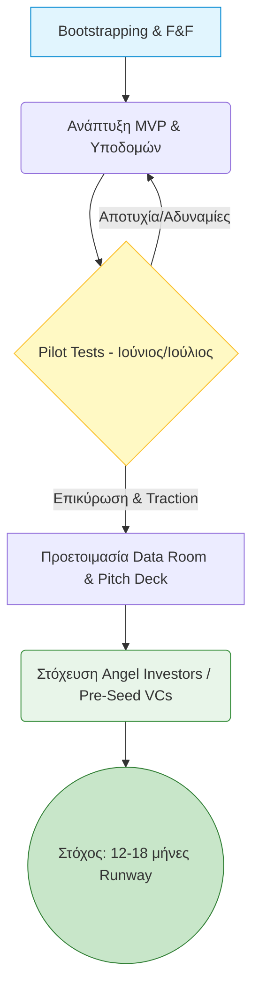

https://drive.google.com/file/d/1-PJIpImfC9_cp3u9tpasHYPyY6s9mxNY/view?usp=sharing
### Βασικές Αρχές & Timing

- **Ιδανική στιγμή για funding:** Αμέσως μετά την επικύρωση του MVP και τη λήψη των πρώτων θετικών μηνυμάτων από την αγορά (market signals). Ιδανικά, μετά τα πιλοτικά σας τον Ιούνιο-Ιούλιο.
- **Οικονομικός Σχεδιασμός:** Υπολογίστε να σηκώσετε αρκετό κεφάλαιο για να εξασφαλίσετε διάδρομο λειτουργίας (runway) 12-18 μηνών, συν ένα επιπλέον buffer.
- **Προσοχή:** Η B2B τεχνολογία στον κλάδο της φιλοξενίας απαιτεί μεγαλύτερα runways και "υπομονετικά" κεφάλαια (patient capital).
- **Αποφυγή Λαθών:** Μην προσπαθήσετε να σηκώσετε κεφάλαια πριν βρείτε το Product-Market Fit (PMF) και αποφύγετε την υπερβολική απώλεια μετοχικού κεφαλαίου (dilution) στα πολύ αρχικά στάδια.
    

### Τι Ψάχνουν οι Επενδυτές (Πώς να πλασάρετε την Orderly)

- **Early traction & Pilots:** Τα δεδομένα από τα 5 πιλοτικά venues θα είναι το ισχυρότερο χαρτί σας.
- **TAM (Total Addressable Market):** Αναδείξτε το μεγάλο μέγεθος της αγοράς (75.000 επιχειρήσεις, 40M τουρίστες).
- **Scalability & Defensibility:** Η υβριδική σας αρχιτεκτονική (Cloud + Local Raspberry Pi) και το batch preparation logic δείχνουν τεχνολογία που κλιμακώνεται και δημιουργεί ανάχωμα στον ανταγωνισμό.

### Travel Tech Tips (Στρατηγική Pitching)

- **Δώστε έμφαση στα Integrations:** Τονίστε τη στρατηγική σας για διασύνδεση με υπάρχοντα συστήματα (π.χ. POS μέσω SBZ, Epsilon Net, myDATA).
- **Real Use Cases:** Εστιάστε στην επίλυση πραγματικών προβλημάτων στο ταξίδι του πελάτη (guest journey), όπως η εξάλειψη της αναμονής και το ξεπέρασμα του γλωσσικού φράγματος.
- **Sales Cycles:** Αναγνωρίστε ανοιχτά στους επενδυτές τις πραγματικότητες του κύκλου πωλήσεων στην εστίαση (π.χ. εποχικότητα).
    

---

### Διάγραμμα Ροής: Στρατηγική Χρηματοδότησης Orderly

Απόσπασμα κώδικα

### Η Διαδικασία του Fundraising

1. **Προετοιμασία:** Δημιουργία Pitch Deck, Financials και Data room.
2. **Στόχευση:** Χτίσιμο μιας έξυπνης λίστας επενδυτών, αποφεύγοντας να μιλάτε στους λάθος ανθρώπους.
3. **Προσέγγιση:** Συνδυασμός warm intros (ιδανικά μέσω των μεντόρων σας) και cold emails.
4. **Pitch:** Χτίστε μια συναρπαστική ιστορία με σαφήνεια, στην οποία οι επενδυτές θα θέλουν να συμμετέχουν.
5. **Κλείσιμο:** Εκμεταλλευτείτε το momentum (π.χ. τα metrics από τη θερινή σεζόν) και δημιουργήστε FOMO (Fear Of Missing Out).
## Επιπτώσεις για την ομάδα (Impact for the team)
Το pitch deck πρέπει να εστιάζει στα integrations (myDATA, Epsilon Net, κλπ) και στο traction από τα πιλοτικά. Τα KPIs πρέπει να αναδεικνύουν την επίλυση πραγματικών προβλημάτων στο guest journey.

## Σχετικές Σημειώσεις
- [[Relevance Branding Workshop]]
- [[pricing_model]]
- [[deck]]

- [ ] Έρευνα για pre-seed VCs στην Ελλάδα που ειδικεύονται σε B2B Hospitality Tech.
- [ ] Έρευνα (Validation experiment): Παρουσίαση του pitch deck σε 3 φιλικούς Angel Investors. Μετρική επιτυχίας: 80% κατανόηση του value prop.
