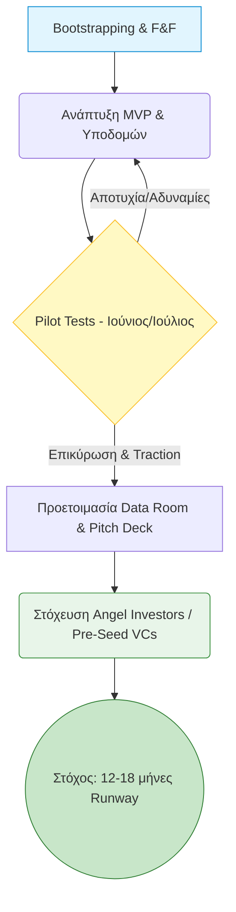

# Εισαγωγή στη Χρηματοδότηση (Introduction to Fundraising)

Πηγή: [Google Drive Link](https://drive.google.com/file/d/1-PJIpImfC9_cp3u9tpasHYPyY6s9mxNY/view?usp=sharing)

## Βασικές Αρχές & Χρονισμός (Timing)

- **Ιδανική στιγμή για χρηματοδότηση (funding):** Αμέσως μετά την επικύρωση του MVP (Minimum Viable Product – Ελάχιστο Βιώσιμο Προϊόν) και τη λήψη των πρώτων θετικών μηνυμάτων από την αγορά (market signals). Ιδανικά, μετά τα πιλοτικά (pilots) τον Ιούνιο-Ιούλιο.
- **Οικονομικός Σχεδιασμός:** Υπολογίστε να σηκώσετε αρκετό κεφάλαιο για να εξασφαλίσετε διάδρομο λειτουργίας (runway) 12-18 μηνών, συν ένα επιπλέον απόθεμα (buffer).
- **Προσοχή:** Η B2B τεχνολογία στον κλάδο της φιλοξενίας απαιτεί μεγαλύτερα runways και "υπομονετικά" κεφάλαια (patient capital).
- **Αποφυγή Λαθών:** Μην προσπαθήσετε να σηκώσετε κεφάλαια πριν βρείτε την κατάλληλη εφαρμογή στην αγορά (PMF - Product-Market Fit) και αποφύγετε την υπερβολική απώλεια μετοχικού κεφαλαίου (dilution) στα πολύ αρχικά στάδια.

## Τι Ψάχνουν οι Επενδυτές (Πώς να πλασάρετε το προϊόν μας)

- **Πρώιμη έλξη (Early traction) & Πιλοτικά (Pilots):** Τα δεδομένα από τα 5 πιλοτικά καταστήματα (venues) θα είναι το ισχυρότερο χαρτί σας.
- **TAM (Total Addressable Market – Συνολική Απευθυνόμενη Αγορά):** Αναδείξτε το μεγάλο μέγεθος της αγοράς (75.000 επιχειρήσεις, 40M τουρίστες).
- **Δυνατότητα κλιμάκωσης & Αμυντικότητα (Scalability & Defensibility):** Η αρχιτεκτονική (όπως η χρήση web-first cloud με τοπικό fallback στο μέλλον) και η λογική μαζικής προετοιμασίας (batch preparation logic) δείχνουν τεχνολογία που κλιμακώνεται και δημιουργεί ανάχωμα στον ανταγωνισμό.

## Συμβουλές Τεχνολογίας Ταξιδιού (Travel Tech Tips & Στρατηγική Pitching)

- **Δώστε έμφαση στις ενσωματώσεις (Integrations):** Τονίστε τη στρατηγική σας για διασύνδεση με υπάρχοντα συστήματα (π.χ. POS μέσω SBZ, Epsilon Net, myDATA).
- **Πραγματικές περιπτώσεις χρήσης (Real Use Cases):** Εστιάστε στην επίλυση πραγματικών προβλημάτων στο ταξίδι του πελάτη (guest journey), όπως η εξάλειψη της αναμονής και το ξεπέρασμα του γλωσσικού φράγματος (language barrier).
- **Κύκλοι πωλήσεων (Sales Cycles):** Αναγνωρίστε ανοιχτά στους επενδυτές τις πραγματικότητες του κύκλου πωλήσεων στην εστίαση (π.χ. εποχικότητα).

## Επιπτώσεις για την ομάδα (Impact for the team)

- Πρέπει πρώτα να επιβεβαιώσουμε την αγορά και το MVP πριν αναζητήσουμε εξωτερική χρηματοδότηση (VC funding).
- Τα επιχειρήματα (pitch) μας προς τους επενδυτές πρέπει να επικεντρώνονται σε metrics, TAM (Total Addressable Market) και στρατηγικές integrations (POS).

### Οπτικοποίηση

```mermaid
graph TD
    A[Bootstrapping & F&F] --> B(Ανάπτυξη MVP & Υποδομών)
    B --> C{Pilot Tests - Ιούνιος/Ιούλιος}
    C -->|Αποτυχία/Αδυναμίες| B
    C -->|Επικύρωση & Traction| D[Προετοιμασία Data Room & Pitch Deck]
    D --> E(Στόχευση Angel Investors / Pre-Seed VCs)
    E --> F((Στόχος: 12-18 μήνες Runway))
    
    style A fill:#e1f5fe,stroke:#0288d1
    style C fill:#fff9c4,stroke:#fbc02d
    style E fill:#e8f5e9,stroke:#388e3c
    style F fill:#c8e6c9,stroke:#2e7d32
```

## Η Διαδικασία της Χρηματοδότησης (Fundraising Process)

1. **Προετοιμασία:** Δημιουργία Παρουσίασης (Pitch Deck), Οικονομικών Στοιχείων (Financials) και Δωματίου Δεδομένων (Data room).
2. **Στόχευση:** Χτίσιμο μιας έξυπνης λίστας επενδυτών, αποφεύγοντας να μιλάτε στους λάθος ανθρώπους.
3. **Προσέγγιση:** Συνδυασμός θερμών εισαγωγών (warm intros - ιδανικά μέσω των μεντόρων) και ψυχρών email (cold emails).
4. **Παρουσίαση (Pitch):** Χτίστε μια συναρπαστική ιστορία με σαφήνεια, στην οποία οι επενδυτές θα θέλουν να συμμετέχουν.
5. **Κλείσιμο:** Εκμεταλλευτείτε τη δυναμική (momentum - π.χ. τα metrics από τη θερινή σεζόν) και δημιουργήστε τον φόβο της απώλειας ευκαιρίας (FOMO - Fear Of Missing Out).

## Σχετικές Σημειώσεις
- [[Relevance Branding Workshop]]
- [[pricing_model]]
- [[../pitch/deck - φαμφάρες type shit]]

## Επόμενες Ενέργειες

- [ ] Έρευνα για pre-seed VCs στην Ελλάδα που ειδικεύονται σε B2B Hospitality Tech.
- [ ] Προετοιμασία δεδομένων (Metrics/Traction) από τα πρώτα πιλοτικά venues για προσθήκη στο Pitch Deck.
