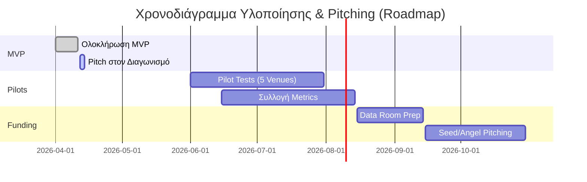

# Στρατηγική Παρουσίασης (Pitch Strategy)

Οδηγίες για την παρουσίαση του (προσωρινά ονομαζόμενου) Project Orderly στον 10-ήμερο διαγωνισμό και σε μελλοντικούς επενδυτές (Investors).

## 1. Δομή Παρουσίασης (10-12 Slides)
1.  **Hook (Εισαγωγή που τραβάει την προσοχή):** Το πρόβλημα του τουρίστα σε ένα beach bar (αναμονή, γλώσσα).
2.  **Πρόβλημα (The Problem):** "Περίμενα 20 λεπτά για ένα menu που δεν καταλάβαινα".
3.  **Λύση (The Solution):** Scan -> Order -> Done (με screenshots).
4.  **Αγορά (The Market - TAM):** 40M τουρίστες, 73K επιχειρήσεις εστίασης (venues), 25% του ΑΕΠ.
5.  **Live Demo (Ζωντανή Επίδειξη):** Το πιο δυνατό σημείο της παρουσίασης.
6.  **Business Model (Επιχειρηματικό Μοντέλο):** SaaS tiers + Seasonal plans (Εποχιακά πακέτα).
7.  **Ανταγωνισμός (Competition):** Γιατί κερδίζουμε (Greek context + specialization).
8.  **Ομάδα (The Team):** Γιατί μπορούμε να το υλοποιήσουμε.
9.  **Ask & Timeline (Αίτημα & Χρονοδιάγραμμα):** MVP σε 10 μέρες -> Pilots το καλοκαίρι -> Seed Funding το Φθινόπωρο.

## 2. Κρίσιμα Επιχειρήματα (Key Selling Points)
*   **Το Κενό στην Αγορά (Market Gap):** Καμία μεγάλη διεθνής πλατφόρμα (όπως το me&u, Sunday) δεν είναι στην Ελλάδα.
*   **Εποχιακή Επείγουσα Ανάγκη (Seasonal Urgency):** Πρέπει να βγούμε τον Ιούνιο για να προλάβουμε την κορύφωση της σεζόν.
*   **Ζωντανή Εμπειρία (Live Experience):** Η εμπειρία του κριτή (Judge) / επενδυτή (Investor) που σκανάρει και βλέπει το menu στο κινητό του χωρίς app install (zero-friction) είναι αξεπέραστη.
*   **Traction & Data:** Τα δεδομένα από τα πιλοτικά (Pilots) είναι ο κύριος μοχλός ανάπτυξης (Growth lever).
*   **Ενοποιήσεις & Άμυνα (Integrations & Defensibility):** Η ικανότητα σύνδεσης με υπάρχοντα POS (myDATA/ΑΑΔΕ/Epsilon Net) και η Offline λειτουργία μας κάνει δύσκολο να αντιγραφούμε.

## 3. Διαχείριση Ερωταπαντήσεων (Q&A)
*   *Γιατί Ελλάδα;* Τεράστια αγορά τουρισμού, ελάχιστος ψηφιακός μετασχηματισμός.
*   *Μονέτα;* SaaS συνδρομή (Subscription) με ευελιξία για την εποχικότητα (Pause/Resume).
*   *Ανταγωνισμός;* Εστιάζουμε αποκλειστικά στην παραγγελιοληψία (Ordering-first) και όχι στο να αλλάξουμε το κύριο POS του καταστήματος.

### Οπτικοποίηση: Παρουσίαση Pitch & Χρονοδιάγραμμα

## Σχετικές Σημειώσεις
- [[deck]] - Το τελικό παρουσιολόγιο (Slide deck)
- [[business/market_strategy]] - Στρατηγική Αγοράς & Χρηματοδότηση
- [[notes/introduction to fund raising]] - Σημειώσεις χρηματοδότησης

## Επόμενες Ενέργειες
- [ ] Προετοιμασία ενός άψογου, bug-free Live Demo περιβάλλοντος για τη μέρα του Pitch.
- [ ] Προετοιμασία λίστας "δύσκολων ερωτήσεων" (FAQ) για το Q&A session.
